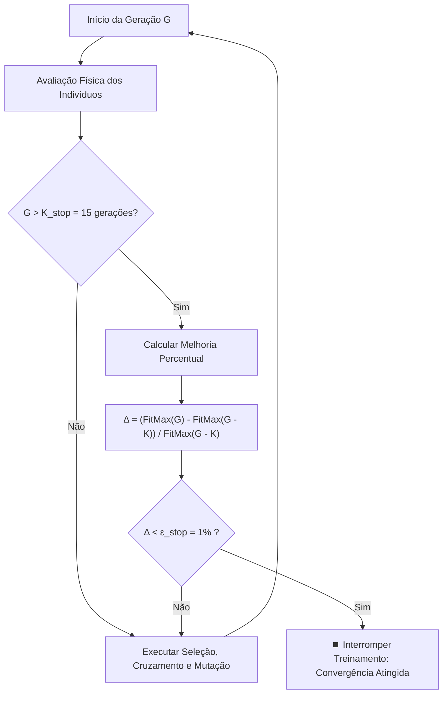

# ⏹️ Critério de Parada e Convergência Estável

Em aplicações de Inteligência Artificial para jogos, a simulação evolutiva não deve rodar indefinidamente quando a população já atingiu um platô de desempenho ótimo.

---

## 🛑 Mecanismo de Parada de Bhandari

Implementamos um critério de parada duplo baseado no trabalho de Bhandari e na teoria clássica de otimização evolutiva:

### 1. Limite Superior de Gerações ($G_{\text{max}}$)
* Um corte rígido para garantir que o simulador nunca exceda o tempo de resposta aceitável ($30$ a $60$ gerações dependendo da dificuldade).

### 2. Estagnação de Fitness ($K = 15, \; \epsilon = 1\%$)
* Se a melhora do fitness máximo ao longo de $15$ gerações consecutivas for inferior a $1\%$, o algoritmo detecta que a população encontrou seu teto tático e interrompe a execução:
  $$\frac{\text{Fit}_{\text{max}}(G) - \text{Fit}_{\text{max}}(G - K)}{\text{Fit}_{\text{max}}(G - K)} < \epsilon$$

---

## 📈 Benefícios Computacionais

1. **Economia de CPU:** Reduz o tempo de treinamento em até $65\%$ no Modo Difícil (que converge tipicamente entre a 15ª e a 20ª geração).
2. **Prevenção de Sobre-ajuste (*Overfitting*):** Evita que a população congele em movimentos excessivamente especializados que falham ao encontrar tiros em ângulos ligeiramente diferentes.

---

## 🔗 Conexões
- [[Parametrização Geral do GA]]
- [[Configuração de Dificuldade]]
- [[Diário de Testes]]
- [[00 - MOC Principal]]
