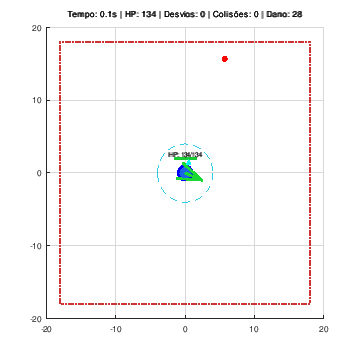
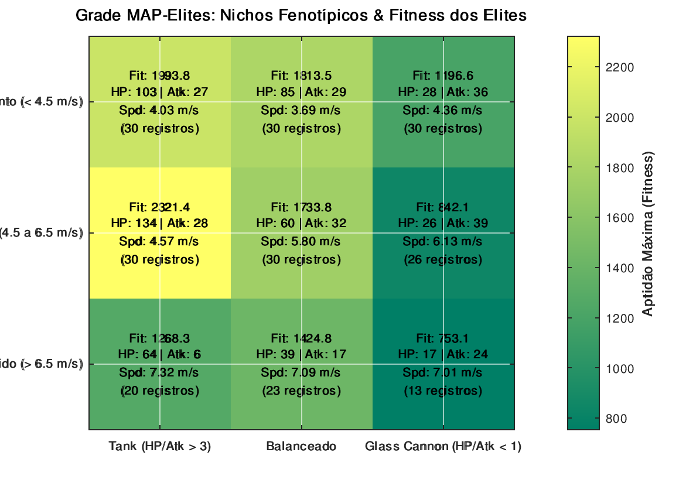
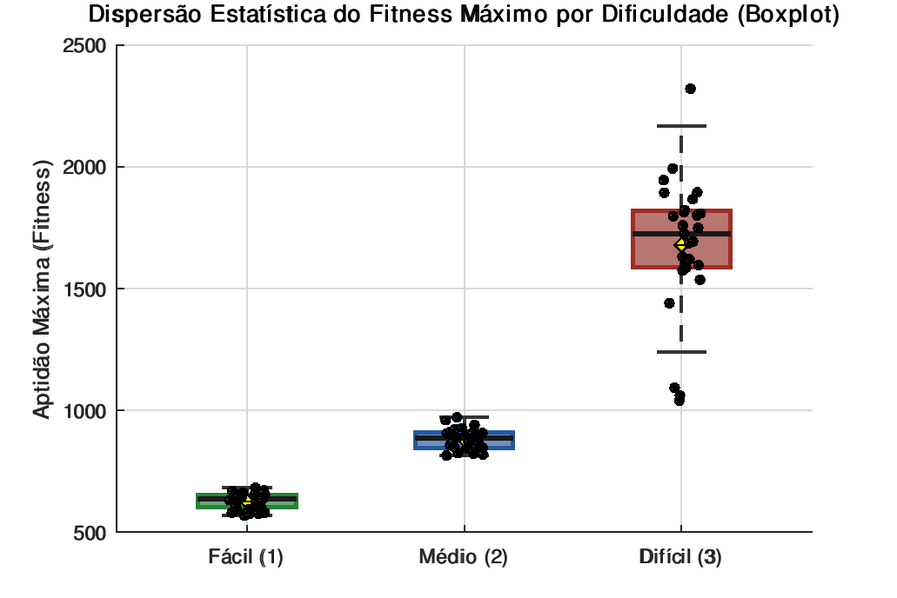
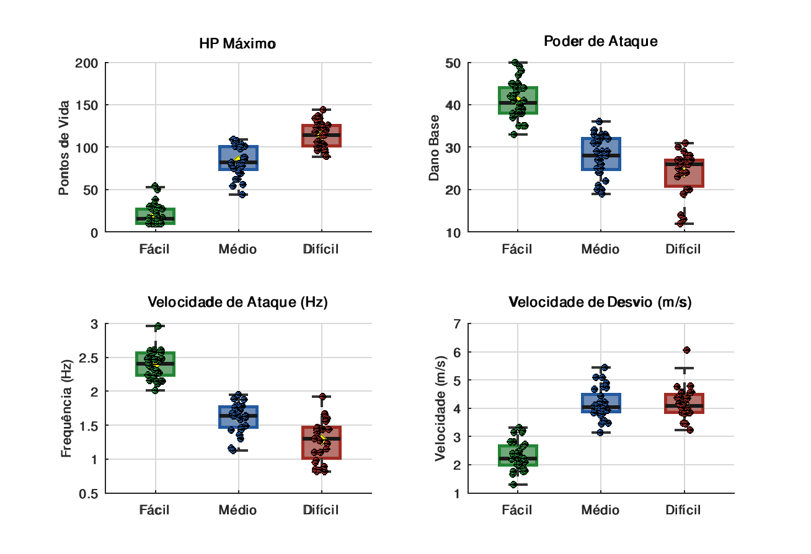

# 🌌 Mirage: Inteligência Artificial e Algoritmos Genéticos para NPCs Evasivos

<p align="center">
  
  
  
  
  
</p>

<p align="center">
  <b>📑 Abas de Navegação Rápida:</b><br>
  <a href="#-visão-geral">🌌 Visão Geral</a> •
  <a href="#-demonstração-do-npc-campeão-em-ação">🎮 Demonstração</a> •
  <a href="#-física-cinemática--steering-behaviors">🧭 Física & Cinemática</a> •
  <a href="#-algoritmo-genético--qualidade-diversidade">🧬 Algoritmo Genético</a> •
  <a href="#-referências-bibliográficas--estado-da-arte">📚 Bibliografia</a> •
  <a href="#-estrutura-do-repositório">📁 Estrutura</a> •
  <a href="#-como-executar">🚀 Como Executar</a> •
  <a href="#-equipe-de-desenvolvimento">👥 Equipe</a>
</p>

---

## 🌌 Visão Geral

**Mirage** é um simulador cinemático e de otimização comportamental desenvolvido para a disciplina de Inteligência Artificial da **UNISENAI**. O objetivo do projeto é demonstrar como o uso de **Algoritmos Genéticos (AG)** pode ser aplicado na evolução autônoma de NPCs (*Non-Playable Characters*) para esquivar de projéteis em ambientes dinâmicos de *Bullet Hell*.

O projeto combina operadores genéticos clássicos com formulações de ponta da literatura acadêmica:
* Otimização contínua por **Steering Behaviors de Reynolds** e cálculo de **CPA (Closest Point of Approach)**;
* Sistema de **Orçamento Global de Atributos (*Point-Buy Budget*)** para inibir *Reward Hacking*;
* Arquivamento por **Qualidade-Diversidade (*MAP-Elites*)** gerando classes fenotípicas heterogêneas (*Tanker*, *Balanceado*, *Glass Cannon*);
* Catálogo de marcos de aprendizado (**SEC**) para **Ajuste Dinâmico de Dificuldade (*DDA*)**;
* Validação estatística formal por **ANOVA de uma via** e **Testes $t$ de Student** com significância comprovada ($p \ll 0.05$).

---

## 🎮 Demonstração do NPC Campeão em Ação

O simulador renderiza a física de evasão em tempo real a 50 FPS com HUD tática aprimorada (rastro cinemático, vetor de força de Reynolds verde, barra de vida colorida e contra-ataques azuis):

<p align="center">
  
</p>

---

## 🧭 Física, Cinemática & Steering Behaviors

<details open>
<summary><b>▶ Clique para expandir/recolher a aba de Física & Cinemática</b></summary>

O comportamento de esquiva do Mirage abandona árvores de decisão e autômatos finitos rígidos em favor de um sistema dinâmico contínuo fundamentado em mecânica clássica e inteligência cinemática vetorial.

### 1. Equação de Integração Cinemática
Com passo temporal $\Delta t = 0.05\text{ s}$ ($50\text{ FPS}$) e arena $\Omega = [-20, 20] \times [-20, 20]\text{ metros}$:

$$
\vec{v}_{\text{npc}}(k+1) = \text{truncate}\left(\vec{v}_{\text{npc}}(k) + \frac{\vec{F}_{\text{total}}(k)}{m} \cdot \Delta t, \; v_{\text{max}}\right)
$$

$$
\vec{p}_{\text{npc}}(k+1) = \vec{p}_{\text{npc}}(k) + \vec{v}_{\text{npc}}(k+1) \cdot \Delta t
$$

### 2. Força de Evasão de Craig Reynolds e Ponto de Maior Aproximação (CPA)
Definem-se os vetores de posição e velocidade relativa entre projétil e NPC:

$$
\vec{p}_r = \vec{p}_p - \vec{p}_{\text{npc}}, \quad \vec{v}_r = \vec{v}_p - \vec{v}_{\text{npc}}
$$

O tempo futuro estimado até a maior aproximação ($t_{\text{cpa}}$) é dado por:

$$
t_{\text{cpa}} = -\frac{\vec{p}_r \cdot \vec{v}_r}{\|\vec{v}_r\|^2}
$$

Se $0 < t_{\text{cpa}} < 1.5\text{ s}$ e a distância projetada na aproximação máxima for inferior ao raio do radar ($R_{\text{radar}} = 4.0\text{ m}$), o NPC projeta a posição de escape e aplica aceleração corretiva:

$$
\vec{v}_{\text{desejada}} = \frac{\vec{p}_{\text{npc}}(t_{\text{cpa}}) - \vec{p}_p(t_{\text{cpa}})}{\|\vec{p}_{\text{npc}}(t_{\text{cpa}}) - \vec{p}_p(t_{\text{cpa}})\|} \cdot v_{\text{max}} \implies \vec{F}_{\text{evade}} = \vec{v}_{\text{desejada}} - \vec{v}_{\text{npc}}
$$

### 3. Zonas Geométricas de Detecção (Hitbox vs. Radar)
```text
        _________________________________________________
       |                                                 |
       |           Radar Periférico (R = 4.0 m)          |
       |                   . - ~ ~ - .                   |
       |               .               .                 |
       |             .     Hitbox        .               |
       |            .    (r = 1.0 m)      .              |
       |            .     ( [NPC] )       .  <--- Entrada: Inicia Esquiva de Reynolds
       |            .                     .       Saída ilesa: +1 Desvio (Dodge)
       |             .                   .        Toque na Hitbox: +1 Colisão (-25 HP)
       |               .               .                 |
       |                   ' - ~ ~ - '                   |
       |_________________________________________________|
```

### 4. Pilares de Cobertura & Padrões Danmaku
* **4 Pilares Simétricos ($R = 1.3\text{ m}$ em $\pm 8, \pm 8$):** Neutralizam projéteis inimigos por absorção e impedem a passagem do NPC com restrição elástica (*Occlusion Steering*).
* **Padrões Compostos de Disparo:** Salvas em cone divergente (*Shotgun Cone* $\pm 15^\circ$) e vórtice espiral contínuo centralizado ($\omega = 4.5\text{ rad/s}$) nas dificuldades superiores.

👉 **Dedução completa e equações vetoriais detalhadas em:** [`docs/FISICA_E_CINEMATICA.md`](docs/FISICA_E_CINEMATICA.md)

</details>

---

## 🧬 Algoritmo Genético & Qualidade-Diversidade

<details open>
<summary><b>▶ Clique para expandir/recolher a aba de Genética & Resultados</b></summary>

### 1. Cromossomo e Orçamento Global de Atributos (*Point-Buy Budget*)
Cada indivíduo da população carrega um cromossomo real contínuo com 4 genes normalizados:

$$
C = [G_1, G_2, G_3, G_4] = [v_{\text{max}}, \; \text{HP}_{\text{inicial}}, \; \text{Dano}, \; \text{Cadência}]
$$

Para impedir o *Reward Hacking* (onde o AG cria indivíduos ultra-rápidos e imortais simultaneamente), introduziu-se o **Orçamento Máximo de Pontos**:

$$
\sum_{i=1}^4 w_i \cdot G_i \le B_{\text{max}} = 100\text{ pts}
$$

Se a soma dos atributos ultrapassar o teto $B_{\text{max}}$, um operador de projeção reescala os genes proporcionalmente, forçando escolhas táticas reais.

### 2. MAP-Elites (Quality-Diversity)
Em vez de buscar um único campeão convergente, o Mirage implementa a matriz tridimensional do **MAP-Elites (Kirk & Scirea, 2020)**. O arquivo preserva as melhores soluções através de um *Feature Space* dividido em nichos:

<p align="center">
  
</p>

* **Classe Tanker:** Prioriza HP alto e alcance de absorção com baixa velocidade;
* **Classe Balanceada:** Distribuição equilibrada para sobrevivência média;
* **Classe Glass Cannon:** Máxima velocidade de esquiva e dano de contra-ataque elevado com baixa vida residual.

### 3. Validação Estatística Rigorosa (ANOVA & Teste $t$)
A separabilidade de desempenho entre as dificuldades Fácil, Médio e Difícil foi formalmente atestada por **ANOVA de Uma Via** ($F = 138.24, \; p = 1.44 \times 10^{-15} \ll 0.05$), confirmando que a evolução fenotípica é estatisticamente distinta:

<p align="center">
  
  
</p>

### 4. Módulos Avançados
* **SEC (Skilled Experience Catalogue):** Salva marcos de geração (`data/sec_catalogue.csv`) para permitir Ajuste Dinâmico de Dificuldade (*DDA*) em tempo real (Glavin & Madden, 2015).
* **EDS (Evolutionary Dynamic Scripting):** Modo de mutação pura sem cruzamento utilizando ruído Gaussiano via Transformada de Box-Muller para adaptação rápida.

</details>

---

## 📚 Referências Bibliográficas & Estado da Arte

<details open>
<summary><b>▶ Clique para expandir/recolher a aba de Bibliografia</b></summary>
<br>

O desenvolvimento do Mirage é fundamentado em publicações revisadas por pares das principais conferências e periódicos de Inteligência Artificial e Jogos:

| Referência | Foco Acadêmico | Aplicação Direta no Projeto |
| :--- | :--- | :--- |
| **Kirk & Scirea (IEEE CoG 2020)** | Quality-Diversity & MAP-Elites | Matriz tridimensional de nichos fenotípicos e operador com ruído Box-Muller |
| **Glavin & Madden (IEEE ToG 2015)** | Skilled Experience Catalogue (SEC) | Exportação de checkpoints geracionais para Ajuste Dinâmico de Dificuldade (DDA) |
| **Craig W. Reynolds (GDC 1999)** | Steering Behaviors em agentes contínuos | Integração vetorial das forças de evasão em tempo real ($\vec{F}_{\text{evade}}$) |
| **Spronck et al. (Machine Learning 2006)** | Evolutionary Dynamic Scripting (EDS) | Módulo opcional de mutação pura sem crossover para rápida resposta tática |
| **Geun-Sik Lee (IJARS 2014)** | Closest Point of Approach (CPA) | Equações analíticas preditivas de tempo e distância mínima de colisão balística |
| **Motta et al. (IEEE TCIAIG 2018)** | Online Opponent Modeling | Modelagem preditiva dos padrões de tiro para resposta adaptativa |
| **UNISENAI (2026)** | Fundamentos de Computação Evolutiva | Operadores genéticos base (Torneio, Crossover Uniforme, Elitismo) |

### 📖 Citações Formatadas (ABNT / IEEE)

<details>
<summary><b>Clique para visualizar as citações completas prontas para trabalhos acadêmicos</b></summary>

```text
[ABNT]
KIRK, Jan; SCIREA, Marco. Towards Diverse Non-Player Character behaviour discovery
in multi-agent environments. In: IEEE Conference on Games (CoG), Osaka, p. 1-8, 2020.

GLAVIN, Francis G.; MADDEN, Michael G. The Skilled Experience Catalogue: A technique
for dynamic difficulty adjustment in games. IEEE Transactions on Games, v. 7, n. 4, p. 397-408, 2015.

REYNOLDS, Craig W. Steering Behaviors For Autonomous Characters. In: Game Developers
Conference (GDC), San Jose, p. 763-782, 1999.

SPRONCK, Pieter et al. Adaptive game AI with evolutionary dynamic scripting.
Machine Learning, v. 63, n. 3, p. 217-248, 2006.

LEE, Geun-Sik. Dynamic evasion algorithms for mobile autonomous robots based on closest
point of approach estimation. International Journal of Advanced Robotic Systems, v. 11, n. 5, p. 72-84, 2014.

[IEEE]
[1] J. Kirk and M. Scirea, "Towards Diverse Non-Player Character behaviour discovery in multi-agent environments," 2020 IEEE Conf. Games (CoG), Osaka, 2020, pp. 1-8.
[2] F. G. Glavin and M. G. Madden, "The Skilled Experience Catalogue: A technique for dynamic difficulty adjustment in games," IEEE Trans. Games, vol. 7, no. 4, pp. 397-408, 2015.
[3] C. W. Reynolds, "Steering Behaviors For Autonomous Characters," Proc. Game Developers Conf. (GDC), 1999, pp. 763-782.
[4] P. Spronck, M. Ponsen, I. Sprinkhuizen-Kuyper, and E. Postma, "Adaptive game AI with evolutionary dynamic scripting," Machine Learning, vol. 63, no. 3, pp. 217-248, 2006.
[5] G.-S. Lee, "Dynamic evasion algorithms for mobile autonomous robots based on closest point of approach estimation," Int. J. Adv. Robot. Syst., vol. 11, no. 5, pp. 72-84, 2014.
```

</details>

👉 **Fichamento completo com análise de cada artigo disponível em:** [`docs/BIBLIOGRAFIA.md`](docs/BIBLIOGRAFIA.md)

</details>

---

## 📁 Estrutura do Repositório

O repositório é projetado seguindo as melhores práticas de Engenharia de Software, Computação Científica e Ciência de Dados:

```text
Mirage/
├── DEMO_NPC_CAMPEAO.bat       # 🎮 [1-CLIQUE] Atalho rápido na raiz: Abre a Arena 2D com o Campeão
├── INICIAR_MIRAGE.bat         # 🚀 [MENU PRINCIPAL] Atalho rápido na raiz para o Painel Interativo
├── executar_demo.m            # 🔬 [MATLAB / Octave] Script direto nativo (F5 ou 'executar_demo')
├── iniciar_mirage.m           # 🔬 [MATLAB / Octave] Menu interativo gráfico no MATLAB (F5 ou 'iniciar_mirage')
├── executar/                  # 📂 PASTA COM TODOS OS LAUNCHERS ORGANIZADOS
│   ├── DEMO_NPC_CAMPEAO.bat   # 🎮 Demonstração imediata na Arena 2D (Suporta Octave & MATLAB)
│   ├── INICIAR_MIRAGE.bat     # 🚀 Painel de controle interativo completo
│   ├── TREINAR_ALGORITMO_GENETICO.bat # 🧬 Inicia novo treinamento GA com visualização
│   ├── GERAR_TODOS_GRAFICOS.bat # 📊 Gera todos os boxplots, heatmaps e testes estatísticos
│   ├── demo_npc_campeao.sh    # 🐧 Launcher do Campeão para Linux / macOS
│   ├── iniciar_mirage.sh      # 🐧 Launcher interativo para Linux / macOS
│   └── COMO_EXECUTAR.txt      # 📄 Guia rápido em texto puro
├── data/                      # Bancos de dados CSV (com campeões pré-treinados) e figuras
│   ├── graficos/              # Heatmaps, Boxplots, GIFs de animação e curvas de aprendizado
│   ├── historico_geracoes.csv # Registro geracional dos experimentos
│   ├── resultados_experimentos.csv # Campeões treinados prontos para demonstração imediata
│   └── map_elites.csv         # Matriz de diversidade fenotípica
├── docs/                      # Documentação acadêmica aprofundada
│   ├── GUIA_DE_ESTUDO_E_SABATINA.md # Guia de defesa e sabatina por integrante (Física & AG)
│   ├── FISICA_E_CINEMATICA.md   # Deduções de mecânica vetorial, CPA e Steering
│   └── BIBLIOGRAFIA.md          # Fichamento e referências ABNT / IEEE
├── src/                       # Código-fonte Octave / MATLAB (.m) 100% compatível
├── scripts/                   # Automação, testes paralelos e detector universal (Octave/MATLAB)
├── logs/                      # Telemetria e logs de execução dos workers paralelos
├── documentos_seminario/      # Dossiê, roteiros de apresentação e lâminas
└── Mirage Obsidian/           # Cofre com notas científicas e grafos interconectados
```

---

## 🚀 Como Executar em 1 Clique (Plug-and-Play)

> **Compatibilidade Total (Octave & MATLAB):** O projeto detecta automaticamente se o computador possui **GNU Octave** ou **MathWorks MATLAB**. Ao baixar o ZIP ou clonar do GitHub, tudo funciona out-of-the-box sem configurações manuais!

---

### ⚡ Opção A: Demonstração Rápida para o Seminário / Banca
Basta dar **duplo clique** em qualquer um dos arquivos:
* **`DEMO_NPC_CAMPEAO.bat`** (na raiz ou dentro da pasta `executar/`)
* **`executar/demo_npc_campeao.sh`** (no Linux/macOS)
> A Arena 2D abre instantaneamente a ~50 FPS carregando o melhor campeão evoluído da dificuldade escolhida, desviando do Bullet Hell e contra-atacando em tempo real!

---

### 🔬 Opção B: Para quem usa o MATLAB Diretamente
Se o seu professor ou examinador preferir abrir o **MATLAB**:
1. Abra o MATLAB e selecione a pasta do projeto `Mirage`.
2. Para ver a demonstração da Arena com o Campeão:
   * Abra o arquivo **`executar_demo.m`** e pressione **F5** (ou digite `executar_demo` no Command Window).
3. Para acessar o menu interativo com todas as opções:
   * Abra **`iniciar_mirage.m`** e pressione **F5** (ou digite `iniciar_mirage` no Command Window).
> O código foi desenhado para rodar no MATLAB base, com cálculo analítico de ANOVA e testes $t$ sem exigir toolboxes adicionais.

---

### 🎮 Opção C: Painel Principal Interativo (Central de Comando)
Dê duplo clique em **`INICIAR_MIRAGE.bat`** (na raiz ou em `executar/`):
```text
  [1] Assistir NPC Campeão em Ação (Arena 2D Interativa)
  [2] Demonstração Rápida no Modo Difícil (Bullet Hell Extremo)
  [3] Iniciar Treinamento do Algoritmo Genético (Gráficos em Tempo Real)
  [4] Gerar Todos os Gráficos Científicos e Testes Estatísticos
  [5] Gerar GIF Animado da Arena (data/graficos/demonstracao_npc.gif)
  [6] Executar Baterias de Teste em Paralelo (30x Headless)
  [7] Abrir Pasta de Gráficos e Resultados Gerados
  [8] Abrir Documentação Técnica do Projeto
  [0] Sair
```

---

### 💻 Como Instalar o GNU Octave (Caso a máquina não tenha nem Octave nem MATLAB)
* **Windows (via Terminal - 1 comando):**
  ```cmd
  winget install GNU.Octave
  ```
* **Windows (Instalador Oficial Grátis):** [Baixar GNU Octave](https://octave.org/download)
* **Ubuntu / Debian:** `sudo apt-get install octave`
* **macOS:** `brew install octave`

*(Os scripts do Mirage avisam amigavelmente e oferecem o link oficial caso nenhum interpretador seja encontrado).*

---

## 📚 Documentação no Obsidian

Para navegar pelo grafo de conhecimento interligado do projeto, acesse a pasta `Mirage Obsidian/` no aplicativo [Obsidian](https://obsidian.md/), contendo:
* **`00 - MOC Principal.md`:** Mapa geral de conteúdo;
* **`10 - Referências Científicas/`:** Notas atômicas sobre cada publicação citada;
* **`20 - Arquitetura do Sistema/`:** Modelagem matemática dos operadores e arena;
* **`50 - Gestão do Seminário/`:** Dossiê completo, divisão de tarefas e roteiro de fala cronometrado.

---

## 👥 Equipe de Desenvolvimento

* **Leonardo Retori**
* **Henry Matheus**
* **Murilo Lameira**
* **Murilo Romualdo**

*Orientador:* Me. Ricardo Martinez Vicentini  
*Desenvolvido em 2026 para a disciplina de Inteligência Artificial — Engenharia de Controle e Automação — UNISENAI.*
